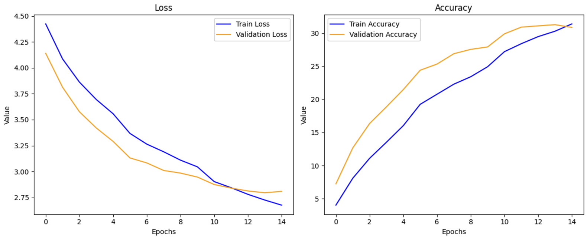

# Food Classification with Deep Learning

This repository explores various deep learning techniques to classify food images from the Food-101 dataset. It includes custom model implementation, transfer learning with DenseNet121, and the use of a Conditional GAN for data augmentation.

## Table of Contents
- [Project Overview](#project-overview)
- [Setup and Requirements](#setup-and-requirements)
- [Implementation Details](#implementation-details)
  - [Custom CNN](#custom-cnn)
  - [Pretrained DenseNet](#pretrained-densenet)
  - [Conditional GAN](#conditional-gan)
  - [DenseNet with Augmented Dataset](#densenet-with-augmented-dataset)
- [Results Summary](#results-summary)
- [Repository Structure](#repository-structure)
- [Acknowledgments](#acknowledgments)
- [License](#license)

## Project Overview

This project aims to classify food images from the Food-101 dataset. The primary objectives are:
1. Compare the performance of a custom Convolutional Neural Network (CNN) with a pretrained DenseNet121.
2. Investigate the impact of data augmentation using a Conditional GAN on classification performance.

## Setup and Requirements

This project requires Python and the following libraries:
```bash
torch
torchvision
matplotlib
numpy
tqdm
```

To install the dependencies:
```bash
pip install torch torchvision matplotlib numpy tqdm
```

## Implementation Details

### Custom CNN

The custom CNN was trained from scratch using resized and normalized Food-101 images. Despite capturing basic features, its performance was limited due to the dataset's complexity.



### Pretrained DenseNet

DenseNet121 was fine-tuned on the Food-101 dataset. Leveraging pretrained ImageNet weights, the model achieved significantly higher accuracy compared to the custom CNN.


### Conditional GAN

A Conditional GAN (cGAN) was trained to generate synthetic food images conditioned on class labels. These images were used to augment the dataset and improve diversity.


### DenseNet with Augmented Dataset

DenseNet121 was also trained on a dataset augmented with GAN-generated images and additional transformations. The results indicate potential benefits, though synthetic images did not fully match real-world complexity.


**Note:** All generated images and plots not included in this repository can be found in the accompanying notebook.

## Results Summary

- **Custom CNN:** Top-1 accuracy: 31.14%, Top-5 accuracy: 59.72%
- **Pretrained DenseNet:** Top-1 accuracy: 57.77%, Top-5 accuracy: 82.06%
- **DenseNet with Augmented Dataset:** Top-1 accuracy: 55.62%, Top-5 accuracy: 79.66%

## Repository Structure

```
.
├── report/              # Report
├── notebooks/           # Jupyter notebooks for training and analysis
├── results/             # Selected images and plots
│   ├── performance_custom_cnn.png
│   ├── performance_densenet.png
│   ├── performance_conditional_gan.png
│   ├── progress_conditional_gan.png
│   ├── performance_densenet_augmented.png
├── README.md            # Project documentation
└── LICENSE              # MIT License
```

## Acknowledgments

- Food-101 dataset: [ETH Zurich](https://data.vision.ee.ethz.ch/cvl/datasets_extra/food-101/)
- PyTorch and TorchVision for providing the deep learning framework
- Contributions from the open-source community for GAN research

## License

This project is licensed under the MIT License.
